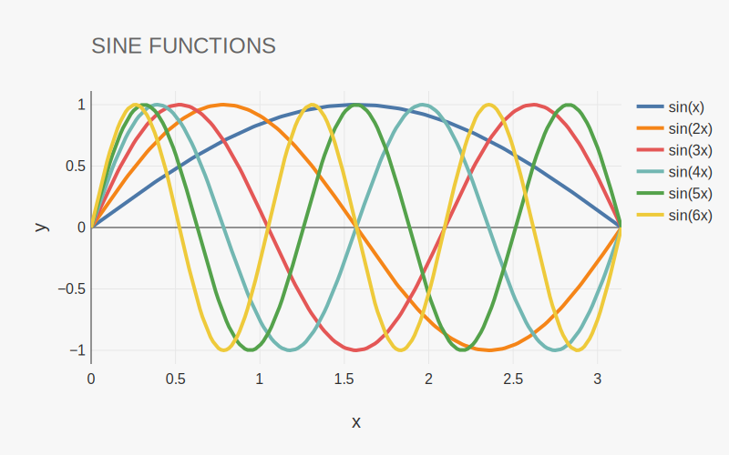

# Overview

> reaktplot is still in its infancy and its API will change in the coming months!

reaktplot is an easy-to-use C++ plotting library powered by [plotly](https://plotly.com/).

Here is an example that shows reaktplot in action:

~~~c++
#include <reaktplot/reaktplot.hpp>
using reaktplot = rkp;

int main()
{
    rkp.Array x = rkp.linspace(0.0, PI, 200);

    rkp.Figure fig;

    fig.titleText("SINE FUNCTIONS");

    fig.xaxisTitleText("x");
    fig.yaxisTitleText("y");

    fig.addScatter(x, Array(std::sin(1.0 * x)), "sin(x)");
    fig.addScatter(x, Array(std::sin(2.0 * x)), "sin(2x)");
    fig.addScatter(x, Array(std::sin(3.0 * x)), "sin(3x)");
    fig.addScatter(x, Array(std::sin(4.0 * x)), "sin(4x)");
    fig.addScatter(x, Array(std::sin(5.0 * x)), "sin(5x)");
    fig.addScatter(x, Array(std::sin(6.0 * x)), "sin(6x)");

    fig.show();

    fig.save("example-readme.svg");
}
~~~

After compiling and executing this C++ application, the following plot (`example-readme.svg`) is produced:

    

The same example can also be ported to Python as follows:

~~~py
import reaktplot as rkp
import numpy as npy

x = npy.linspace(0.0, npy.pi, 200)

fig = rkp.Figure()

fig.titleText("SINE FUNCTIONS")

fig.xaxisTitleText("x")
fig.yaxisTitleText("y")

fig.addScatter(x, npy.sin(1.0 * x), "sin(x)")
fig.addScatter(x, npy.sin(2.0 * x), "sin(2x)")
fig.addScatter(x, npy.sin(3.0 * x), "sin(3x)")
fig.addScatter(x, npy.sin(4.0 * x), "sin(4x)")
fig.addScatter(x, npy.sin(5.0 * x), "sin(5x)")
fig.addScatter(x, npy.sin(6.0 * x), "sin(6x)")

fig.show()

fig.save("example-readme.svg")
~~~

# License

MIT License

Copyright (c) 2022-2023 Allan Leal

Permission is hereby granted, free of charge, to any person obtaining a copy of this software and
associated documentation files (the "Software"), to deal in the Software without restriction,
including without limitation the rights to use, copy, modify, merge, publish, distribute,
sublicense, and/or sell copies of the Software, and to permit persons to whom the Software is
furnished to do so, subject to the following conditions:

The above copyright notice and this permission notice shall be included in all copies or substantial
portions of the Software.

THE SOFTWARE IS PROVIDED "AS IS", WITHOUT WARRANTY OF ANY KIND, EXPRESS OR IMPLIED, INCLUDING BUT
NOT LIMITED TO THE WARRANTIES OF MERCHANTABILITY, FITNESS FOR A PARTICULAR PURPOSE AND
NONINFRINGEMENT. IN NO EVENT SHALL THE AUTHORS OR COPYRIGHT HOLDERS BE LIABLE FOR ANY CLAIM, DAMAGES
OR OTHER LIABILITY, WHETHER IN AN ACTION OF CONTRACT, TORT OR OTHERWISE, ARISING FROM, OUT OF OR IN
CONNECTION WITH THE SOFTWARE OR THE USE OR OTHER DEALINGS IN THE SOFTWARE.
